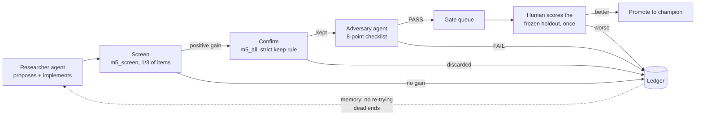

# kepler

**An autonomous forecasting-research loop with gates that keep it honest.**

kepler is a research harness where AI agents propose, implement and backtest forecasting
models on their own, and a chain of independent checks decides which results are real. It is
built and tested on the public [M5 Forecasting](https://www.kaggle.com/competitions/m5-forecasting-accuracy)
dataset (Walmart unit sales: 30,490 item-store series, 1,913 days, scored on the 12-level
hierarchical WRMSSE).

The interesting output is not the model. It is the evidence that an unattended loop can do real
forecasting research, including finding genuine improvements, **without fooling itself**.

---

## The question

Can an AI agent, wired to a reproducible backtest harness, run scored forecasting experiments
unattended and produce improvements that survive a frozen holdout it never sees?

That breaks into three testable claims:

1. **Throughput.** The agent can run many honest, fully logged experiments per hour.
2. **Integrity.** An independent adversary can catch leakage and seed-luck that the researcher
   misses, including a deliberately planted leak.
3. **Transfer.** The loop produces a candidate that beats the baseline on a holdout it never
   touched, and rejects candidates that only look good in backtest.

## Results at a glance

All scores are M5 12-level hierarchical WRMSSE (lower is better). The holdout is the
competition's evaluation period (d_1914 to d_1941), cut once by a human and never read by any
agent.

| Model | Holdout | Backtest | Notes |
|---|---:|---:|---|
| Seasonal naive | 0.870 | — | reference on our holdout window |
| LightGBM baseline | 0.723 | 0.785 ¹ | lags, rolling means, calendar, price |
| M5 recipe (champion v1) | 0.626 | 0.698 ¹ · 0.667 ² | direct multi-horizon, rolling stats, price, calendar |
| **Recipe + capacity (champion v2)** | **0.622** | **0.652 ²** | num_leaves 511; current champion |

¹ Eight winter-heavy folds (harness v1 to v8). ² Eight year-round quarterly folds (v9 onward).
Backtests on different fold layouts are not comparable with each other; the holdout column is.

For context, published M5 leaderboard scores (on the competition's private window, which is
about 2.7% easier than ours by the seasonal-naive yardstick): best statistical benchmark
ES_bu 0.671, rank 50 0.576 (≈0.591 adjusted to our window), winner 0.520. The champion beats
every published benchmark and sits about 0.03 from top 50. **This is a harness test, not a
leaderboard entry.**

What the loop demonstrated:

- **49 scored runs per hour** from one researcher session, each committed and logged.
- **The adversary caught a planted look-ahead leak** and rejected two real branches whose
  gains did not survive reseeding.
- **The holdout gate caught a mirage.** A recursive-plus-direct ensemble won both backtest
  tiers and then *lost* on the holdout (0.644 vs 0.626). It was not promoted.
- **The loop fixed its own instrument.** Backtest gains were overstating holdout gains about
  5:1 because no fold reached the holdout's calendar window. Mirroring that window in prior
  years brought the ratio to about 1.5:1.
- **No holdout shot was ever spent on a candidate that later failed.** Every rejected idea
  since then was stopped by the calibrated backtest or the adversary first.

See [docs/findings.md](docs/findings.md) for the full account, including every lever that did
not work and why.

## How it works



| Role | Who | What it can touch |
|---|---|---|
| Researcher | AI agent | `src/features.py`, `src/model.py`, the ledger, findings. Never the scorer, folds or holdout. |
| Adversary | separate AI agent, fresh context | Reads everything, reruns with unseen seeds, writes verdicts. Never edits `src/`. |
| Curator | AI agent | Rewrites dataset priors from confirmed findings, behind a merge gate. |
| Human | owner | Cuts the holdout, scores it (one shot per candidate), promotes champions, owns frozen files. |

### Design principles

- **The scorer is frozen.** Metric code is human-owned (`CODEOWNERS`) and checked by
  `make verify-frozen` against a tagged baseline. Agents cannot move the goalposts.
- **The holdout is physically separate.** It lives in a gitignored `holdout/` directory that
  no agent reads, lists or writes. Scoring it is a human action, one shot per candidate.
- **Every run is reproducible.** The backtest refuses to run on a dirty git tree, so every
  logged row carries a clean commit hash. Snapshots are verified against a SHA-256 manifest.
- **The keep rule is statistical, not a threshold.** A candidate is kept only if it wins a
  one-sided sign test across folds, has a positive median per-fold gain, does not regress any
  fold beyond seed noise, and does not worsen bias.
- **Features are leak-free by construction.** Every feature reads data strictly before the
  forecast origin, enforced with asserts in `src/features.py`.
- **The ledger is the loop's memory.** Every hypothesis is recorded with its lever, outcome
  and mechanism, and `tools/ledger_check.py` blocks re-running a dead end.
- **Backtest folds mirror the evaluation window.** The `holdout_mirror` layout forecasts the
  holdout's calendar window in prior years, so backtest gains predict holdout gains.

## Quick start

Requirements: Python 3.11 or 3.12, [uv](https://docs.astral.sh/uv/), and on macOS
`brew install libomp` (LightGBM needs it). 16 GB of RAM or more for the full panel with parallel fits.

```bash
git clone https://github.com/rslayer/kepler.git && cd kepler
make env                              # install pinned dependencies with uv
```

**Get the data.** M5 is not redistributed here. Accept the competition rules on Kaggle, put
your Kaggle API token at `~/.kaggle/access_token` (mode 600; the legacy `kaggle.json` also
works), then build a snapshot:

```bash
make data DATASET=m5_screen           # all 10 stores, 1/3 of items (fast screening tier)
make data DATASET=m5_all              # full panel, 30,490 series
```

No Kaggle account? `python tools/make_fixture.py` writes synthetic data with M5's schema so you
can exercise the harness end to end. Never report a number produced from it.

**Cut the holdout (once, by a human)**, then run a backtest:

```bash
make holdout DATASET=m5_screen
make backtest MODEL=recipe6_calendar_l2_cap511 DATASET=m5_screen
make report                           # all runs, ranked
make report RUN=<run_id>              # error breakdown for one run
```

Model names are registered in `src/model.py` (`MODELS`). See
[docs/running-the-loop.md](docs/running-the-loop.md) for the full operator guide, including how
to run agent sessions.

## Repository layout

```
src/
  contract.py, adapters/   data contract and the M5 adapter (datasets: m5_all, m5_screen, ...)
  data.py                  download, subset, snapshot + SHA-256 manifest
  features.py              leak-free feature construction (researcher-editable)
  model.py                 every model the loop has tried, registered in MODELS
  backtest.py              rolling-origin folds, seeds, the keep rule (fold logic frozen)
  scorer.py, scorer_hier.py  WRMSSE and 12-level hierarchical WRMSSE (frozen)
  score_holdout.py         the human-only holdout scorer (frozen)
  reconcile.py, recursive.py  experimental components (reconciliation, recursive forecasting)
tools/                     ledger check, search loop, orchestration, adversary pass, gate queue,
                           promotion, audits, benchmarks
runs/                      runs.csv (every backtest), detail/ (per-run JSON), holdout.csv
findings/                  one write-up per run
hypotheses/                the ledger (m5_all/ledger.csv is the consolidated one)
adversary/                 adversary instructions and reviews
datasets/<id>/             per-dataset priors and confirmed lessons
champion.json              the promoted champion per dataset, with lineage
```

## Documentation

| Document | What it covers |
|---|---|
| [docs/methodology.md](docs/methodology.md) | Data, metric, folds, keep rule, adversary, holdout protocol, the champion model |
| [docs/findings.md](docs/findings.md) | What worked, what did not, the mirages caught, open questions |
| [docs/running-the-loop.md](docs/running-the-loop.md) | Setup, commands, agent roles, running sessions |
| [RESULTS.md](RESULTS.md) | The lab notebook: detailed state at each version |
| [HARNESS_CHANGELOG.md](HARNESS_CHANGELOG.md) | Every harness change, with the reason and the evidence |
| `SPEC*.md` | The human-written specs that drove each phase, in order |

## How this was built

The harness was written almost entirely by an AI coding agent (Claude Code) working from
human-written specs (`SPEC.md` through `SPEC_v10_diversity.md`). Each spec defined tasks and
acceptance criteria; the agent executed them and stopped at each boundary for review. The
human owned the scorer, the holdout, and every promotion decision. The agent roles inside the
loop (researcher, adversary, curator) are defined by the `CLAUDE.md` files.

## Data

M5 data belongs to its providers and is used under the Kaggle competition rules. This repository
does not contain raw M5 data: `make data` downloads it with your own Kaggle credentials, and only
the SHA-256 manifest is committed.
